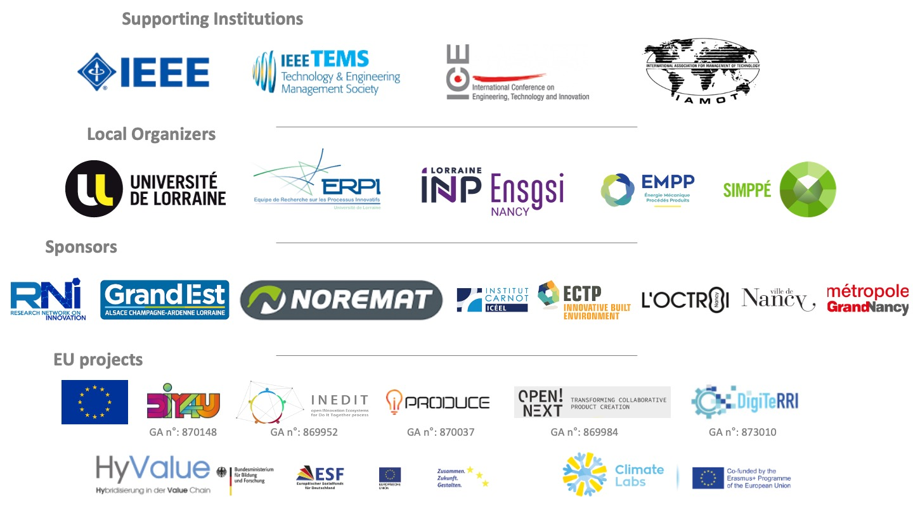

```{r setup, include=FALSE}
knitr::opts_chunk$set(echo = FALSE)

library(tidyverse)

#create_post("Post-2", draft = TRUE)

library(bs4cards) # To install before
```

## Supporting Institutions

```{r, include=TRUE, layout="l-page"}
Sponsors <- 
  tribble(
    ~Title,  ~Image,~Link,
    "ICE Community",   
    'Figures/Sponsors/supporting/IEEE.png',
    " ",
    
    "ICE Community",   
    'Figures/Sponsors/supporting/IEEE-2.jpg',
    " ",
    
    "ICE Community",   
    'Figures/Sponsors/supporting/Ice.png',
    "https://ice-iamot-2022-conference.org/1-history.html",
    
    "IAMOT Community",   
    'Figures/Sponsors/supporting/Iamot.png',
  'http://www.iamot.com/'
  )

Sponsors %>% 
  cards(
    link = Link,
    image = Image,
    width = 1,
    border_width=0,
    spacing = 5,
    border_radius = 0
    #footer = paste("posted:", date)
  )
```


```{r, layout="l-page"}

```


Are you interested in sponsoring the conference ? 
[**Sponsoring grid**](assets/2022_ICE-IAMOT_Sponsorship_Grid.pdf)
