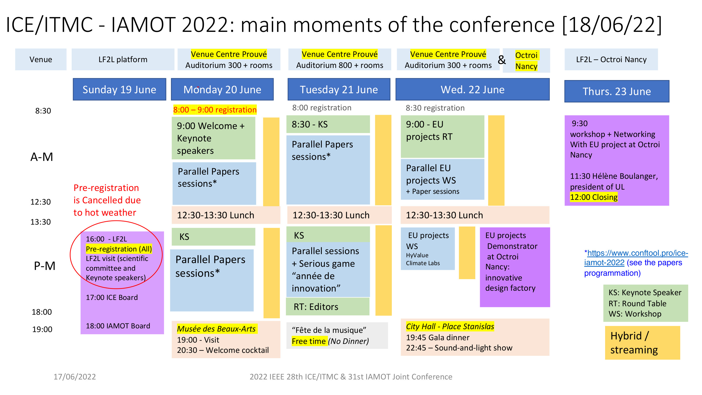

```{r setup, include=FALSE}
knitr::opts_chunk$set(echo = FALSE)
```


**[`r format(Sys.time(), '%d %B, %Y')`]** We present a tentative programme.
But, we are working in the construction of the final one:


```{r, layout="l-page", out.width='100%'}

```


<div class="layout-chunk" data-layout="l-page">
<center>
<h3>Presentation ICE/IAMOT 2022</h3>
<object data=
"assets/ICE-ppt.pdf" width="100%" height="700"> 
</object>
</center>


</div>
